<p align="center">
  
</p>

<p align="center">
  <b><a href="https://methodv.app">methodv.app</a></b> ·
  <a href="#what-it-does">What it does</a> ·
  <a href="#screenshots">Screenshots</a> ·
  <a href="#how-its-built">How it's built</a> ·
  <a href="#try-it-yourself">Try it yourself</a>
</p>

# Method V

**Show off your app. Get real feedback. Get traction.**

Method V is where builders post the apps they've made with a quick 60-second demo, called a **Drop**, and get real people to try them and say honestly what works and what doesn't.

Building an app has never been easier. Getting anyone to actually open it is the hard part: you post it on Reddit or X and it's buried in minutes, with no users and no feedback. Method V is a place made just for that step.

It's live at **[methodv.app](https://methodv.app)**, with a phone app for iPhone and Android on the way.

## What it does

| | |
|---|---|
| 📤 **Post in 2 minutes** | Paste your link. Method V reads your site (even an App Store or Google Play page) and fills in the name, tagline and category. Add a 60-second demo video if you want. |
| 📱 **The Drops feed** | A swipeable, full-screen feed of app demos, like TikTok for apps. One tap on **Try it** opens the real thing. The "For you" ranking learns what each person is into. |
| 💬 **Honest feedback** | After trying an app, people answer: would you use it, what worked, and what confused you, with screenshots. Only the builder sees it. |
| 🪙 **Test & earn** | Testers earn credits (Methodium) for helpful feedback. Builders spend them to get more testers. Helping others is how you get help. |
| ❓ **Questions and polls** | Builders ask their users anything, with one-tap polls, right in the feed. |
| 👤 **Profiles and reputation** | Followers, your apps, a Tester Passport with ranks and stamps, and a status like Hiring or Open to collab. |
| 🚀 **Grow** | Launch days, a Spotlight spot on the home page, challenges with prizes, an embeddable Try-it badge, and stats on where your tries come from. |
| 🤝 **Sponsorships** | Builders set packages and prices (a sponsored card, a shout-out, a newsletter mention). Payments and payouts run through Stripe. |

## Screenshots

The screenshots show the site's built-in sample apps.

| | |
|---|---|
| 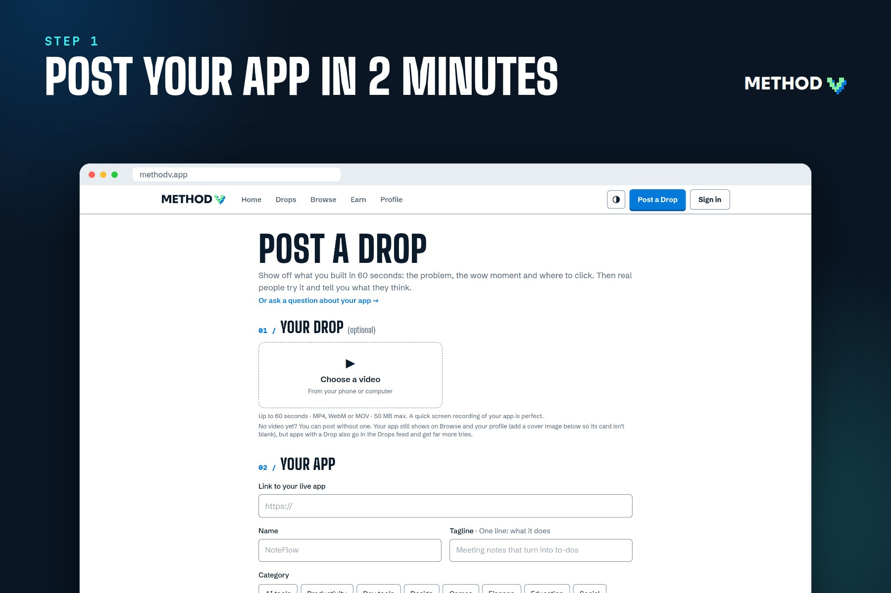 | 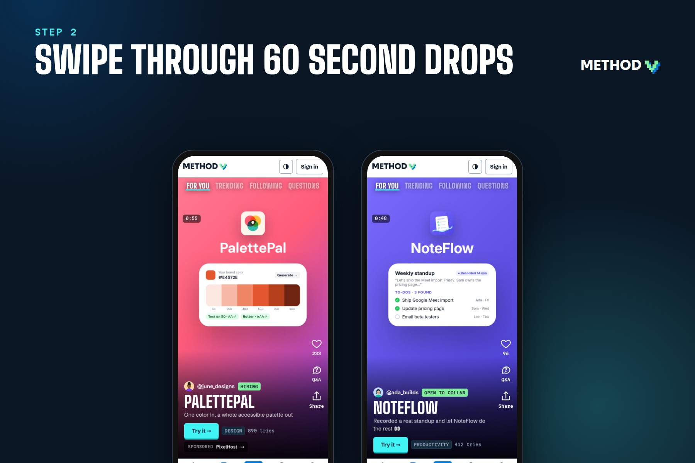 |
| 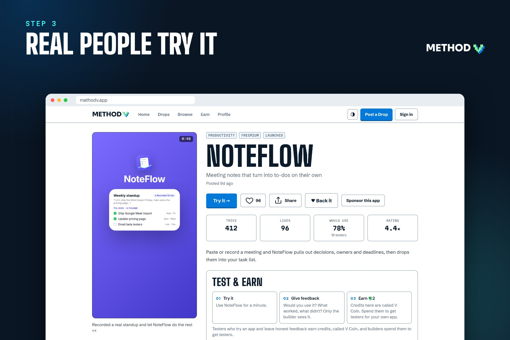 | 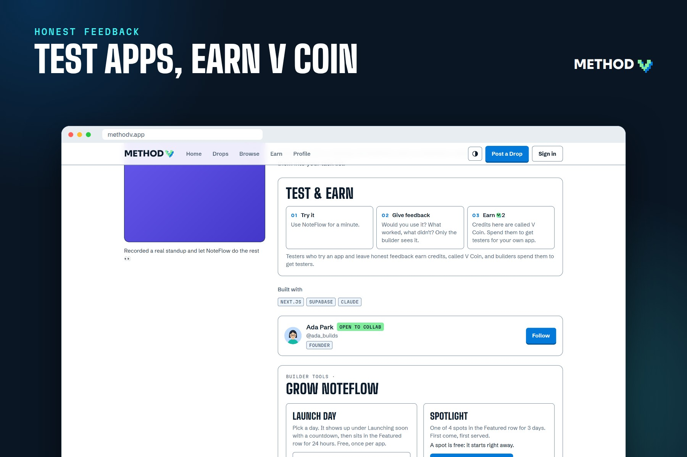 |
| 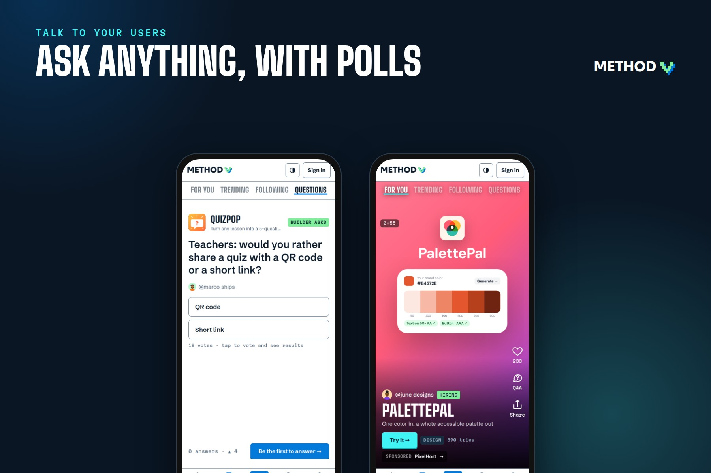 | 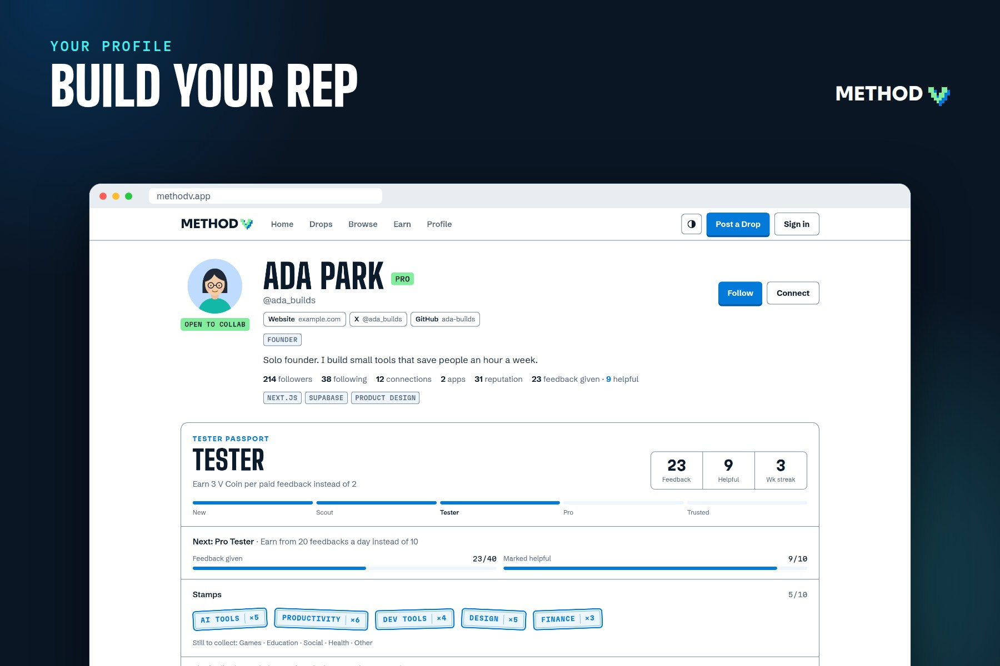 |
| 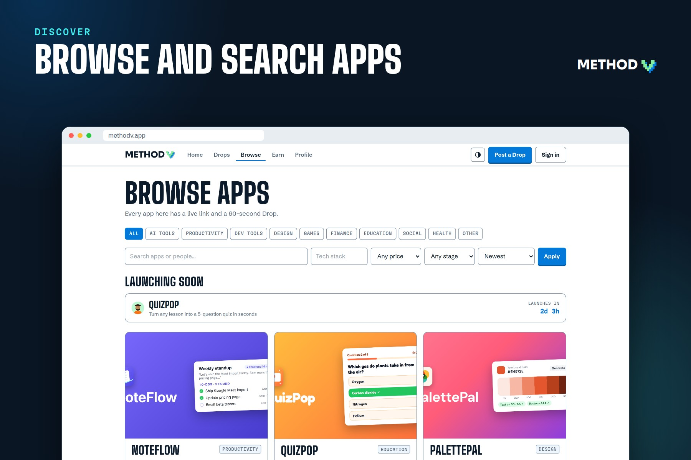 | 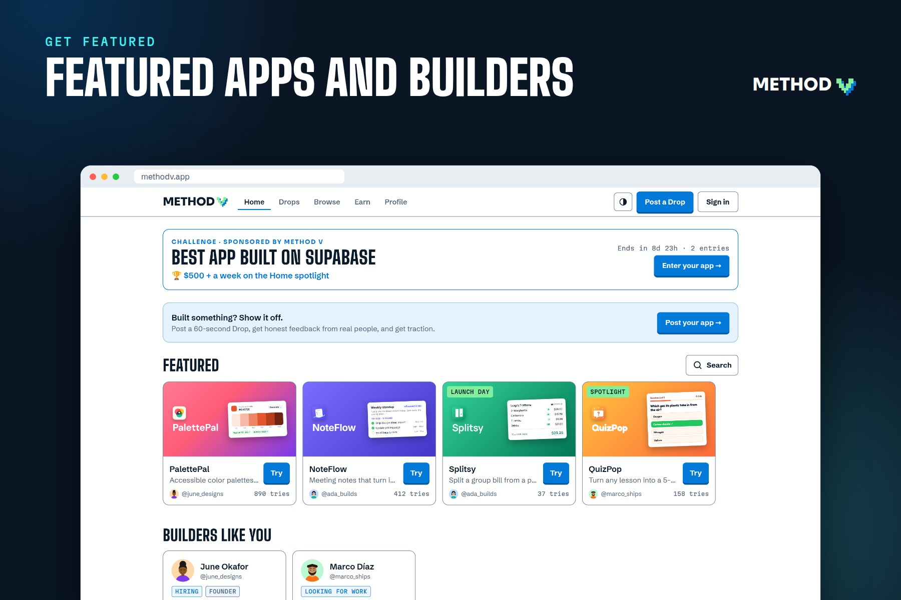 |
| 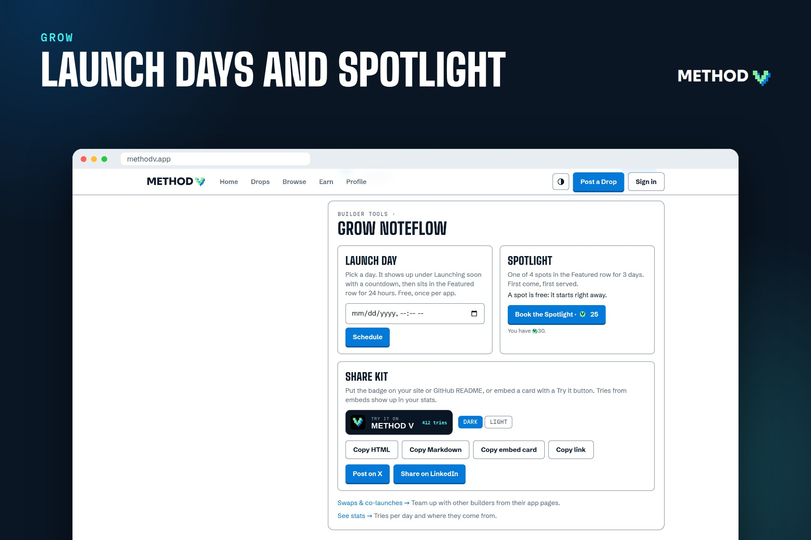 | 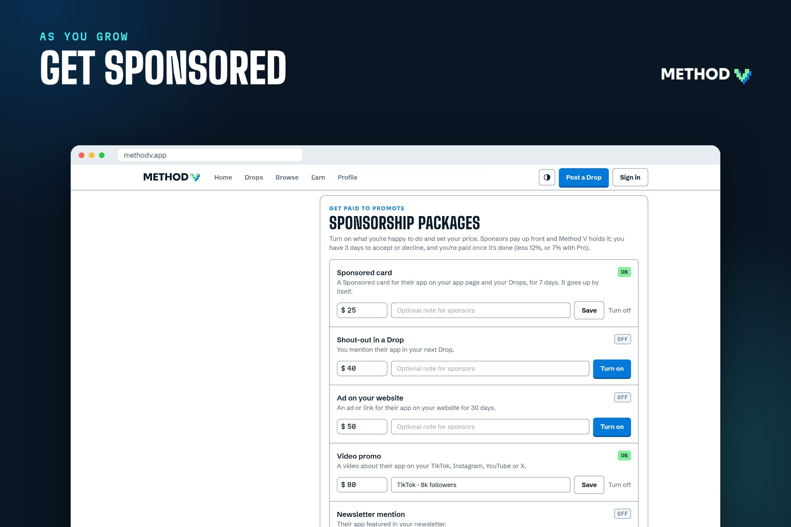 |

## How it's built

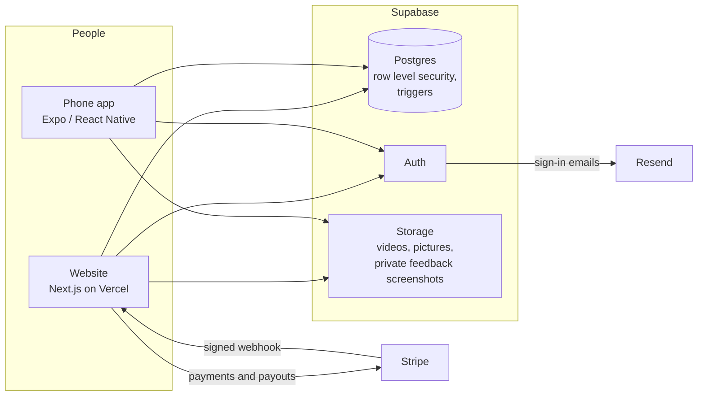

- **Website:** Next.js 16 (App Router, server actions), React 19, TypeScript and Tailwind CSS 4, hosted on Vercel.
- **Phone app:** Expo (React Native) in [`mobile/`](mobile/README.md). It shares the website's types, constants and ranking code, so the two can't drift apart.
- **Database:** Supabase Postgres. The rules live in the database itself, in [`supabase/migrations/`](supabase/migrations).
- **Payments:** Stripe Checkout and Connect, called over plain REST with signed webhooks.
- **Also:** Supabase Auth (email and password, Google, Apple, GitHub), Resend for email, web push notifications, and Vercel Analytics.

### Things I'm proud of under the hood

- **Counts can't be faked.** Likes, tries, followers and credits are only changed by database triggers, never by the browser. Each signed-in person counts once per app for tries.
- **Feedback is private.** Row level security means only the tester and the builder can read it. Screenshots live in a private bucket and open through links that expire after an hour.
- **Safe link checks.** When someone posts an app, the server loads their link before it goes live, and blocks private and internal addresses so the check can't be abused.
- **Money moves only through the server.** Payments are completed only by Stripe's signed webhook, and nothing about payments or earnings can be written from the browser.
- **The feed doesn't just show "newest first."** Each Drop gets a score from how fresh it is, how popular it is, and how well it matches what you're into. It won't show the same builder twice in a row, so new people get a fair shot.

## Try it yourself

The live site is **[methodv.app](https://methodv.app)**.

To run it on your own computer, you only need Node.js 20 or newer. No accounts or keys are needed:

```bash
npm install
npm run dev
```

Open http://localhost:3000. With no keys, it runs in **demo mode** with sample apps, so you can click through everything.

To connect a real database, payments and notifications, follow the full guide in [docs/SETUP.md](docs/SETUP.md).

## Tests

The project has hundreds of automated checks:

```bash
npm run lint && npx tsc --noEmit
npm run test:unit      # link previews, category guesses, link safety, Stripe signatures
npm run test:db        # 400+ security rule checks against a real Postgres, in memory
npm run test:queries   # every database query in the site and app, checked against the schema
npm run build && npm start   # then, in another terminal:
npm run test:ui        # clicks through the site in a real browser
npm run test:crawl     # visits every page on phone and laptop sizes: no broken links or errors
```

## Repo guide

| Folder | What's in it |
|---|---|
| [`src/app/`](src/app) | Website pages, server actions and API routes |
| [`src/components/`](src/components) | Interface pieces (feed, feedback, profiles…) |
| [`src/lib/`](src/lib) | Data loading, ranking, link checks, payments, shared rules |
| [`supabase/migrations/`](supabase/migrations) | Database tables, security rules and triggers |
| [`mobile/`](mobile) | The iPhone and Android app (Expo) |
| [`tests/`](tests) | Unit, database, query, browser and crawl tests |
| [`docs/`](docs) | [Setup guide](docs/SETUP.md), [product plan](docs/PLAN.md), screenshots |
| [`brand/`](brand) | Logo files |

## What's next

- The phone app on the **App Store and Google Play**
- Growing the community, one real builder at a time
- Real sponsorships as more builders and testers join
- Smarter matching, so each app reaches the people most likely to love it

---

Built by a vibe coder, for vibe coders, with AI coding tools (Claude Code). **[Try Method V →](https://methodv.app)**
